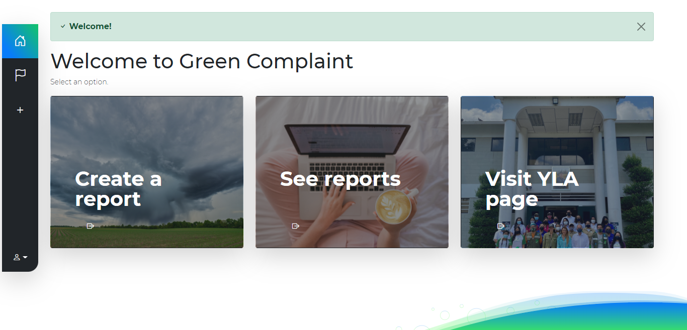

# Green Complaint | Report enviroment problems

If you see any issues, such as items being recycled the wrong way, say it on **Green Complaint**! Feel free to come and report the issue. Add the necessary data so that something can be done about it. You can also see reports from other people and support the environment. 

## Features

- Refreshed UI
- Account options
- Create, edit, and mark reports as resolved
- Restore reports
- And more...



## Install in your local environment

Want to create your own? Or contribute? Perfect. To install Green Complaint on your desktop first you need clone the repo, install all the dependencies, and run.

```bash
$ git clone https://github.com/mlamota2020/green-complaint.git
$ cd green-complaint
$ npm install
$ ready!!!
```
### Scripts

There are some scripts for development and production.

#### 1.- `npm start`

With `npm start`, Green Complaint will start the server at [`localhost:4000`](http://localhost:4000).

#### 2.- `npm run dev`

`npm run dev` starts a development server powered by Nodemon by restarting it for you when you do changes.

#### 3.- `npm run build-win|mac|linux`

Packages the app in a 'build' folder for the selected OS. By example, if you want to package for Windows, execute `npm run build-win`. For Mac, `npm run build-mac`. And for Linux, `npm run build-linux`.
## Downloads

You want to use Green Complaint? No problem, you can download it [here](https://github.com/mlamota2020/green-complaint/releases), or use the [web version](https://green-complaint.mlamota2020.repl.co).

## FAQs

- ### What if I want to contribute the repo?

Well, you can make changes and create a pull request with the commit. DON'T MAKE THE CHANGES DIRECTLY!!

----------

> • 2021 YLA - Environmental Club. Coded by Matias La Mota | Logo by Sebastián Heras. Made with ♥
